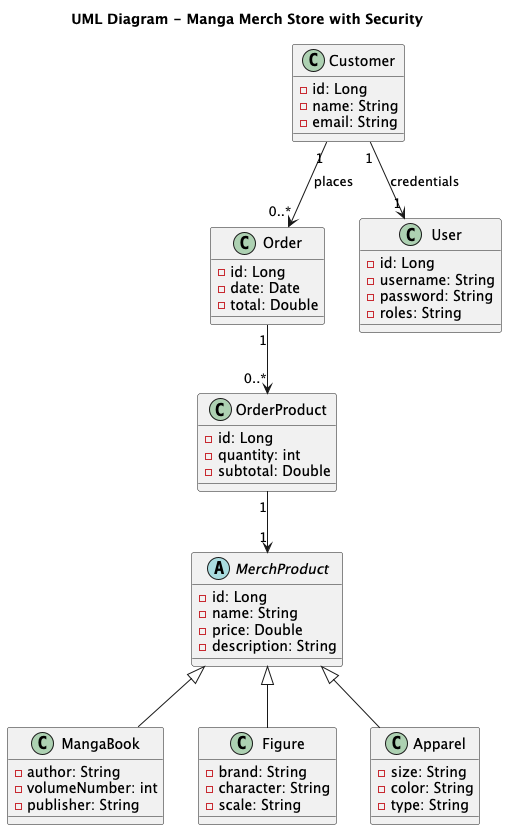
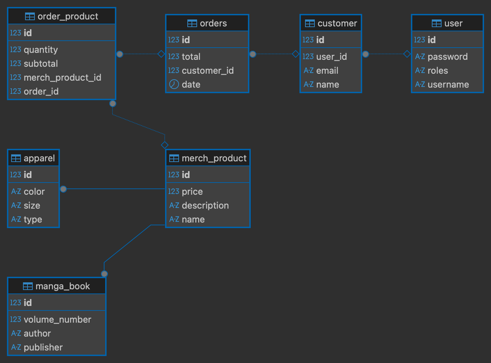

# E-commerce App


## Table of Contents
1. [Description](#description)
2. [Project Structure](#project-structure)
    - [Backend](#backend)
    - [Frontend](#frontend)
3. [Technology Stack](#technology-stack-extracted-from-pomxml)
4. [Data Initialization](#data-initialization)
5. [Deployment](#deployment)
6. [Testing](#testing)
7. [Deployment & How to Run](#deployment--how-to-run)
8. [Application Features](#application-features)
9. [Security](#security)
    - [Security and Handling of the JWT Secret Key](#security-and-handling-of-the-jwt-secret-key)
    - [Recommended Practice in Professional Environments](#recommended-practice-in-professional-environments)
10. [API Endpoints](#api-endpoints)
    - [Authentication](#authentication)
    - [Products](#products)
    - [Orders](#orders)
11. [PUML Diagrams](#puml-diagrams)
    - [Class Diagram](#class-diagram)
    - [UML Diagram](#uml-diagram)

---

## Description

This is a **Spring Boot E-commerce application** for managing a manga store. It includes authentication, role-based authorization, CRUD operations for products, customers, and orders, JWT-based security, and a React frontend.

Main functionalities:

- User registration and login with JWT authentication.
- Management of Manga Books, Figures, and Apparel.
- Creation of customer orders with order products.
- Role-based access control (`ROLE_USER`, `ROLE_ADMIN`).
- Admin panel with product edit and delete functionalities.
- Shopping cart for registered users.
- Product search and listing.
- Database connectivity check button.
- REST API documented with Swagger.

[⬆️ Volver al inicio](#table-of-contents)

---

## Project Structure

### Backend

```text
├── docs
│   ├── ClassDiagram.puml
│   ├── diagrams
│   │   ├── ClassDiagram.png
│   │   ├── Ecommerce.png
│   │   ├── flowchart.png
│   │   └── FluxDiagram.png
│   └── FluxDiagram.puml
├── mvnw
├── mvnw.cmd
├── pom.xml
├── src
│   ├── main
│   │   ├── java
│   │   │   └── store
│   │   │       └── ecommerce
│   │   │           ├── config
│   │   │           │   ├── DataInitializer.java
│   │   │           │   └── OpenAPIConfig.java
│   │   │           ├── controller
│   │   │           │   ├── AuthController.java
│   │   │           │   ├── CustomerController.java
│   │   │           │   ├── HealthController.java
│   │   │           │   ├── MerchProductController.java
│   │   │           │   ├── OrderController.java
│   │   │           │   └── RegisterController.java
│   │   │           ├── dto
│   │   │           │   ├── apparelDTO
│   │   │           │   │   ├── ApparelRequestDTO.java
│   │   │           │   │   ├── ApparelResponseDTO.java
│   │   │           │   │   └── ApparelUpdateDTO.java
│   │   │           │   ├── authDTO
│   │   │           │   │   ├── AuthRequestDTO.java
│   │   │           │   │   └── AuthResponseDTO.java
│   │   │           │   ├── customerDTO
│   │   │           │   │   ├── CustomerRequestDTO.java
│   │   │           │   │   ├── CustomerResponseDTO.java
│   │   │           │   │   └── CustomerUpdateDTO.java
│   │   │           │   ├── figureDTO
│   │   │           │   │   ├── FigureRequestDTO.java
│   │   │           │   │   ├── FigureResponseDTO.java
│   │   │           │   │   └── FigureUpdateDTO.java
│   │   │           │   ├── mangaBookDTO
│   │   │           │   │   ├── MangaBookRequestDTO.java
│   │   │           │   │   ├── MangaBookResponseDTO.java
│   │   │           │   │   └── MangaBookUpdateDTO.java
│   │   │           │   ├── merchProductDTO
│   │   │           │   │   ├── MerchProductRequestDTO.java
│   │   │           │   │   ├── MerchProductResponseDTO.java
│   │   │           │   │   └── MerchProductUpdateDTO.java
│   │   │           │   ├── orderDTO
│   │   │           │   │   ├── OrderRequestDTO.java
│   │   │           │   │   ├── OrderResponseDTO.java
│   │   │           │   │   └── OrderUpdateDTO.java
│   │   │           │   ├── orderProductDTO
│   │   │           │   │   ├── OrderProductRequestDTO.java
│   │   │           │   │   ├── OrderProductResponseDTO.java
│   │   │           │   │   └── OrderProductUpdateDTO.java
│   │   │           │   └── registerDTO
│   │   │           │       ├── RegisterRequestDTO.java
│   │   │           │       └── RegisterResponseDTO.java
│   │   │           ├── EcommerceApplication.java
│   │   │           ├── enums
│   │   │           │   ├── OrderStatus.java
│   │   │           │   └── Role.java
│   │   │           ├── exception
│   │   │           │   ├── BadRequestException.java
│   │   │           │   ├── ExceptionResponseHelper.java
│   │   │           │   ├── GlobalExceptionHandler.java
│   │   │           │   ├── InvalidCredentialsException.java
│   │   │           │   ├── PasswordMismatchException.java
│   │   │           │   ├── ResourceNotFoundException.java
│   │   │           │   └── UsernameAlreadyExistsException.java
│   │   │           ├── model
│   │   │           │   ├── Apparel.java
│   │   │           │   ├── Customer.java
│   │   │           │   ├── Figure.java
│   │   │           │   ├── MangaBook.java
│   │   │           │   ├── MerchProduct.java
│   │   │           │   ├── Order.java
│   │   │           │   ├── OrderProduct.java
│   │   │           │   └── User.java
│   │   │           ├── repository
│   │   │           │   ├── ApparelRepository.java
│   │   │           │   ├── CustomerRepository.java
│   │   │           │   ├── FigureRepository.java
│   │   │           │   ├── MangaBookRepository.java
│   │   │           │   ├── MerchProductRepository.java
│   │   │           │   ├── OrderProductRepository.java
│   │   │           │   ├── OrderRepository.java
│   │   │           │   └── UserRepository.java
│   │   │           ├── security
│   │   │           │   ├── CustomUserDetailsService.java
│   │   │           │   ├── JwtAuthenticationEntryPoint.java
│   │   │           │   ├── JwtAuthenticationFilter.java
│   │   │           │   ├── JwtTokenProvider.java
│   │   │           │   └── SecurityConfig.java
│   │   │           ├── service
│   │   │           │   ├── impl
│   │   │           │   │   ├── CustomerServiceImpl.java
│   │   │           │   │   ├── MerchProductServiceImpl.java
│   │   │           │   │   ├── OrderServiceImpl.java
│   │   │           │   │   ├── RegisterServiceImpl.java
│   │   │           │   │   └── UserServiceImpl.java
│   │   │           │   └── interfaces
│   │   │           │       ├── CustomerService.java
│   │   │           │       ├── MerchProductService.java
│   │   │           │       ├── OrderService.java
│   │   │           │       ├── RegisterService.java
│   │   │           │       └── UserService.java
│   │   │           └── util
│   │   │               └── PasswordHashGenerator.java
│   │   └── resources
│   │       ├── application.properties
│   │       └── data.sql
│   └── test
│       └── java
│           └── store
│               └── ecommerce
│                   ├── controller
│                   │   ├── AuthControllerTest.java
│                   │   ├── CustomerControllerTest.java
│                   │   ├── MerchProductControllerTest.java
│                   │   └── OrderControllerTest.java
│                   ├── EcommerceApplicationTests.java
│                   ├── security
│                   │   ├── CustomUserDetailsServiceTest.java
│                   │   ├── JwtAuthenticationEntryPointTest.java
│                   │   ├── JwtAuthenticationFilterTest.java
│                   │   ├── JwtTokenProviderTest.java
│                   │   └── SecurityConfigTest.java
│                   └── service
│                       └── impl
│                           ├── CustomerServiceImplTest.java
│                           ├── MerchProductServiceImplTest.java
│                           ├── OrderServiceImplTest.java
│                           └── UserServiceImplTest.java

```
### Frontend

```text
├── package-lock.json
├── package.json
├── public
│   ├── assets
│   │   └── manga-store.jpg
│   └── vite.svg
├── README.md
├── src
│   ├── api
│   │   ├── api.js
│   │   ├── auth.service.js
│   │   ├── items.service.js
│   │   └── products.service.js
│   ├── App.css
│   ├── App.jsx
│   ├── assets
│   │   └── react.svg
│   ├── components
│   │   ├── CheckConnection.jsx
│   │   ├── Navbar.jsx
│   │   └── ProtectedRoute.jsx
│   ├── context
│   │   ├── AuthContext.jsx
│   │   └── CartContext.jsx
│   ├── index.css
│   ├── main.jsx
│   └── pages
│       ├── Customers
│       ├── Home
│       ├── Items
│       ├── Login
│       ├── NotFound
│       ├── Orders
│       ├── Products
│       └── Signup
└── vite.config.js

```

[⬆️ Volver al inicio](#table-of-contents)

---

# Technology Stack Extracted from pom.xml

## Backend
- **Language:** Java 17
- **Framework:** Spring Boot 3.5.5
- **Security:** Spring Security

## Persistence
- **Database:** MySQL
- **ORM:** Spring Data JPA

## Build Tool
- **Tool:** Maven

## JWT
- **Library:** JJWT
- **Version:** 0.11.5

## Lombok
- **Library:** Lombok
- **Optional:** true

## Testing
- **Unit & Integration Testing:** JUnit (Spring Boot Starter Test)
- **Mocking:** Mockito Core, Mockito JUnit Jupiter
- **Security Testing:** Spring Security Test

## Documentation
- **API Docs:** Swagger (Springdoc OpenAPI)
- **Version:** 2.8.4

## Frontend
- **Framework:** React 19.1.1
- **DOM:** React DOM 19.1.1
- **Build Tool:** Vite 7.1.7

## Containerization
- **Docker:** 28.4.0, build d8eb465

[⬆️ Volver al inicio](#table-of-contents)

---

## Data Initialization

Database is initialized via `data.sql` located in `backend/src/main/resources`, which includes:

- Admin and customer users.
- Sample products (MangaBooks, Figures, Apparel).
- Sample orders.

[⬆️ Volver al inicio](#table-of-contents)

---

## Testing

Unit and integration tests are implemented using **JUnit** and **Mockito**:

- `src/test/java/store/ecommerce/controller` → Controller tests
- `src/test/java/store/ecommerce/security` → Security components
- `src/test/java/store/ecommerce/service/impl` → Service layer tests

Run tests with Maven:

```bash
mvn test
```

[⬆️ Volver al inicio](#table-of-contents)

---

## Deployment & How to Run

### Deployment

Deployment is handled with Docker and Make. Available commands:

- **Start all services in background:**
```bash
make up
```
- **Stop all services:**
```bash
make down
```
- **Build images without starting containers:**
```bash
make build
```
- **Rebuild and start all services:**
```bash
make rebuild
```
- **View logs in real time:**
```bash
make logs
```
- **Clean volumes, containers, and images:**
```bash
make clean
```

### RUN

Backend API accessible at: http://localhost:8080

Swagger UI available at: http://localhost:8080/swagger-ui.html

Frontend accessible at: http://localhost:3000

[⬆️ Volver al inicio](#table-of-contents)

---

## Application Features

- Admin mode with edit and delete product functionalities.
- Shopping cart available only for registered users.
- Database connectivity check button.
- Product search and listing features.
- Full REST API for authentication, products, and orders.
- JWT authentication and role-based authorization.
- Frontend implemented with React + Vite.

[⬆️ Volver al inicio](#table-of-contents)

---

# Security

## Security and Handling of the JWT Secret Key

In this project, the secret key used to sign JWT tokens (`security.jwt.secret`) is stored in the `application.properties` file. This is **not recommended in a production environment**, but it was done this way for **educational purposes**:

- It allows the professor to easily run and test the application without needing to configure environment variables.
- It makes it easier to review the project without blocking access to the authentication functionality.

### Recommended Practice in Professional Environments

In real-world projects, the JWT secret should **not** be stored in code or versioned configuration files. Recommended approaches:

- Store the secret in **environment variables** or **secret management services**.
- Configure Spring Boot to read the secret from an environment variable:

```properties
security.jwt.secret=${JWT_SECRET}
```

[⬆️ Volver al inicio](#table-of-contents)

---

## API Endpoints

### Authentication

| Endpoint            | Method | Description               | Access |
|--------------------|--------|---------------------------|--------|
| /api/auth/login     | POST   | Login user and get JWT    | Public |
| /api/auth/register  | POST   | Register a new user       | Public |

### Products

| Endpoint               | Method | Description                   | Access      |
|-----------------------|--------|-------------------------------|------------|
| /api/products         | GET    | Get all products              | Public     |
| /api/products/{id}    | GET    | Get product by ID             | Public     |
| /api/products         | POST   | Create new product            | Admin only |
| /api/products/{id}    | PUT    | Update product by ID          | Admin only |
| /api/products/{id}    | DELETE | Delete product by ID          | Admin only |

### Orders

| Endpoint             | Method | Description                   | Access          |
|---------------------|--------|-------------------------------|----------------|
| /api/orders         | GET    | Get all orders                 | Admin only      |
| /api/orders         | POST   | Create order                   | User            |
| /api/orders/{id}    | GET    | Get order by ID                | Admin/User      |
| /api/orders/{id}    | PUT    | Update order status            | Admin only      |

[⬆️ Volver al inicio](#table-of-contents)

---

## PUML Diagrams

### Class Diagram:


[⬆️ Volver al inicio](#table-of-contents)

---

### UML Diagram


[⬆️ Volver al inicio](#table-of-contents)