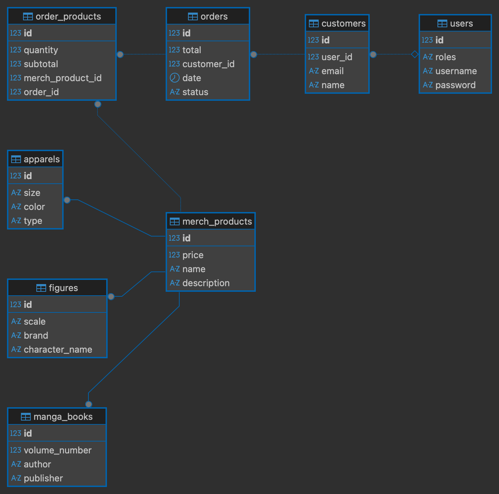

# E-commerce App

## Project Structure

```text
ecommerce-app/
 ├── src/main/java/store/ecommerce/
 │    ├── EcommerceApplication.java
 │
 │    ├── config/
 │    │     └── DataInitializer.java
 │
 │    ├── controller/
 │    │     ├── AuthController.java
 │    │     ├── CustomerController.java
 │    │     ├── OrderController.java
 │    │     └── MerchProductController.java
 │
 │    ├── dto/
 │    │     ├── merchproduct/
 │    │     │     ├── MerchProductRequestDTO.java
 │    │     │     ├── MerchProductResponseDTO.java
 │    │     │     └── MerchProductUpdateDTO.java
 │    │     │
 │    │     ├── mangabook/
 │    │     │     ├── MangaBookRequestDTO.java
 │    │     │     ├── MangaBookResponseDTO.java
 │    │     │     └── MangaBookUpdateDTO.java
 │    │     │
 │    │     ├── figure/
 │    │     │     ├── FigureRequestDTO.java
 │    │     │     ├── FigureResponseDTO.java
 │    │     │     └── FigureUpdateDTO.java
 │    │     │
 │    │     ├── apparel/
 │    │     │     ├── ApparelRequestDTO.java
 │    │     │     ├── ApparelResponseDTO.java
 │    │     │     └── ApparelUpdateDTO.java
 │    │     │
 │    │     ├── customer/
 │    │     │     ├── CustomerRequestDTO.java
 │    │     │     ├── CustomerResponseDTO.java
 │    │     │     └── CustomerUpdateDTO.java
 │    │     │
 │    │     ├── order/
 │    │     │     ├── OrderRequestDTO.java
 │    │     │     ├── OrderResponseDTO.java
 │    │     │     └── OrderUpdateDTO.java
 │    │     │
 │    │     ├── orderproduct/
 │    │     │     ├── OrderProductRequestDTO.java
 │    │     │     ├── OrderProductResponseDTO.java
 │    │     │     └── OrderProductUpdateDTO.java
 │    │     │
 │    │     └── auth/
 │    │           ├── AuthRequestDTO.java
 │    │           └── AuthResponseDTO.java
 │
 │    ├── model/
 │    │     ├── Customer.java
 │    │     ├── Order.java
 │    │     ├── OrderProduct.java
 │    │     ├── MerchProduct.java
 │    │     ├── MangaBook.java
 │    │     ├── Figure.java
 │    │     ├── Apparel.java
 │    │     └── User.java
 │
 │    ├── repository/
 │    │     ├── CustomerRepository.java
 │    │     ├── OrderRepository.java
 │    │     ├── MerchProductRepository.java
 │    │     └── UserRepository.java
 │
 │    ├── service/
 │    │     ├── interfaces/
 │    │     │     ├── CustomerService.java
 │    │     │     ├── OrderService.java
 │    │     │     ├── MerchProductService.java
 │    │     │     └── UserService.java
 │    │     │
 │    │     └── impl/
 │    │           ├── CustomerServiceImpl.java
 │    │           ├── OrderServiceImpl.java
 │    │           ├── MerchProductServiceImpl.java
 │    │           └── UserServiceImpl.java
 │
 │    ├── security/
 │    │     ├── JwtAuthenticationFilter.java
 │    │     ├── JwtTokenProvider.java
 │    │     ├── SecurityConfig.java
 │    │     └── CustomUserDetailsService.java
 │
 │    └── exception/
 │          ├── GlobalExceptionHandler.java
 │          └── ResourceNotFoundException.java
 │
 ├── src/main/resources/
 │    └── application.properties
 │
 └── src/test/java/store/ecommerce/
      ├── CustomerServiceTest.java
      ├── OrderServiceTest.java
      ├── MerchProductServiceTest.java
      └── AuthControllerTest.java


```
## SECURITY

### Security and Handling of the JWT Secret Key

In this project, the secret key used to sign JWT tokens (`security.jwt.secret`) is stored in the `application.properties` file. This is **not recommended** in a production environment, but it was done this way for educational purposes:

- It allows the professor to easily run and test the application without needing to configure environment variables.
- It makes it easier to review the project without blocking access to the authentication functionality.

#### Recommended Practice in Professional Environments

In real-world projects, the JWT secret **should not be stored in code or versioned configuration files**. It is recommended to:

1. Store the secret in **environment variables** or **secret management services**.
2. Configure Spring Boot to read the secret from an environment variable:

security.jwt.secret=${JWT_SECRET}

## PUML Diagrams


## UML Diagram


