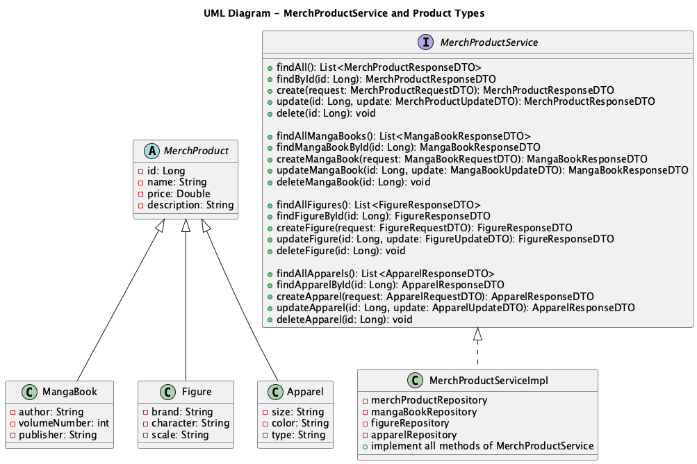

# E-commerce App

## Table of Contents
1. [Description](#description)
2. [Project Structure](#project-structure)
3. [Technology Stack](#technology-stack-extracted-from-pomxml)
    - [Backend](#backend)
    - [Persistence](#persistence)
    - [Build Tool](#build-tool)
    - [JWT](#jwt)
    - [Lombok](#lombok)
    - [Testing](#testing)
    - [Documentation](#documentation)
4. [Data Initialization](#data-initialization)
5. [Testing](#testing-1)
6. [How to Run](#how-to-run)
7. [Security](#security)
    - [Security and Handling of the JWT Secret Key](#security-and-handling-of-the-jwt-secret-key)
    - [Recommended Practice in Professional Environments](#recommended-practice-in-professional-environments)
8. [API Endpoints](#api-endpoints)
    - [Authentication](#authentication)
    - [Products](#products)
    - [Orders](#orders)
9. [PUML Diagrams](#puml-diagrams)
    - [Class Diagram](#class-diagram)
    - [Flux Diagram](#flux-diagram)
    - [Flow Chart](#floow-chart)
    - [UML Diagram](#uml-diagram)

---

## Description

This is a **Spring Boot E-commerce application** for managing a manga store. It includes authentication, role-based authorization, CRUD operations for products, customers, and orders, and JWT-based security.

The main functionalities include:

- User registration and login with JWT authentication.
- Management of Manga Books, Figures, and Apparel.
- Creation of customer orders with order products.
- Role-based access control (`ROLE_USER`, `ROLE_ADMIN`).
- REST API documented with Swagger.

---

## Project Structure

```text
├── HELP.md
├── README.md
└── ecommerce
    ├── docs
    │   ├── ClassDiagram.puml
    │   ├── FluxDiagram.puml
    │   └── diagrams
    │       ├── ClassDiagram.png
    │       ├── Ecommerce.png
    │       └── FluxDiagram.png
    ├── mvnw
    ├── mvnw.cmd
    ├── pom.xml
    └── src
        ├── main
        │   ├── java
        │   │   └── store
        │   │       └── ecommerce
        │   │           ├── EcommerceApplication.java
        │   │           ├── config
        │   │           │   ├── DataInitializer.java
        │   │           │   └── OpenAPIConfig.java
        │   │           ├── controller
        │   │           │   ├── AuthController.java
        │   │           │   ├── CustomerController.java
        │   │           │   ├── MerchProductController.java
        │   │           │   └── OrderController.java
        │   │           ├── dto
        │   │           │   ├── apparelDTO
        │   │           │   │   ├── ApparelRequestDTO.java
        │   │           │   │   ├── ApparelResponseDTO.java
        │   │           │   │   └── ApparelUpdateDTO.java
        │   │           │   ├── authDTO
        │   │           │   │   ├── AuthRequestDTO.java
        │   │           │   │   └── AuthResponseDTO.java
        │   │           │   ├── customerDTO
        │   │           │   │   ├── CustomerRequestDTO.java
        │   │           │   │   ├── CustomerResponseDTO.java
        │   │           │   │   └── CustomerUpdateDTO.java
        │   │           │   ├── figureDTO
        │   │           │   │   ├── FigureRequestDTO.java
        │   │           │   │   ├── FigureResponseDTO.java
        │   │           │   │   └── FigureUpdateDTO.java
        │   │           │   ├── mangaBookDTO
        │   │           │   │   ├── MangaBookRequestDTO.java
        │   │           │   │   ├── MangaBookResponseDTO.java
        │   │           │   │   └── MangaBookUpdateDTO.java
        │   │           │   ├── merchProductDTO
        │   │           │   │   ├── MerchProductRequestDTO.java
        │   │           │   │   ├── MerchProductResponseDTO.java
        │   │           │   │   └── MerchProductUpdateDTO.java
        │   │           │   ├── orderDTO
        │   │           │   │   ├── OrderRequestDTO.java
        │   │           │   │   ├── OrderResponseDTO.java
        │   │           │   │   └── OrderUpdateDTO.java
        │   │           │   └── orderProductDTO
        │   │           │       ├── OrderProductRequestDTO.java
        │   │           │       ├── OrderProductResponseDTO.java
        │   │           │       └── OrderProductUpdateDTO.java
        │   │           ├── enums
        │   │           │   ├── OrderStatus.java
        │   │           │   └── Role.java
        │   │           ├── exception
        │   │           │   ├── BadRequestException.java
        │   │           │   ├── ExceptionResponseHelper.java
        │   │           │   ├── GlobalExceptionHandler.java
        │   │           │   ├── InvalidCredentialsException.java
        │   │           │   ├── ResourceNotFoundException.java
        │   │           │   └── UsernameAlreadyExistsException.java
        │   │           ├── model
        │   │           │   ├── Apparel.java
        │   │           │   ├── Customer.java
        │   │           │   ├── Figure.java
        │   │           │   ├── MangaBook.java
        │   │           │   ├── MerchProduct.java
        │   │           │   ├── Order.java
        │   │           │   ├── OrderProduct.java
        │   │           │   └── User.java
        │   │           ├── repository
        │   │           │   ├── ApparelRepository.java
        │   │           │   ├── CustomerRepository.java
        │   │           │   ├── FigureRepository.java
        │   │           │   ├── MangaBookRepository.java
        │   │           │   ├── MerchProductRepository.java
        │   │           │   ├── OrderProductRepository.java
        │   │           │   ├── OrderRepository.java
        │   │           │   └── UserRepository.java
        │   │           ├── security
        │   │           │   ├── CustomUserDetailsService.java
        │   │           │   ├── JwtAuthenticationEntryPoint.java
        │   │           │   ├── JwtAuthenticationFilter.java
        │   │           │   ├── JwtTokenProvider.java
        │   │           │   └── SecurityConfig.java
        │   │           └── service
        │   │               ├── impl
        │   │               │   ├── CustomerServiceImpl.java
        │   │               │   ├── MerchProductServiceImpl.java
        │   │               │   ├── OrderServiceImpl.java
        │   │               │   └── UserServiceImpl.java
        │   │               └── interfaces
        │   │                   ├── CustomerService.java
        │   │                   ├── MerchProductService.java
        │   │                   ├── OrderService.java
        │   │                   └── UserService.java
        │   └── resources
        │       └── application.properties
        └── test
            └── java
                └── store
                    └── ecommerce
                        ├── EcommerceApplicationTests.java
                        ├── controller
                        │   ├── AuthControllerTest.java
                        │   ├── CustomerControllerTest.java
                        │   ├── MerchProductControllerTest.java
                        │   └── OrderControllerTest.java
                        ├── security
                        │   ├── CustomUserDetailsServiceTest.java
                        │   ├── JwtAuthenticationEntryPointTest.java
                        │   ├── JwtAuthenticationFilterTest.java
                        │   ├── JwtTokenProviderTest.java
                        │   └── SecurityConfigTest.java
                        └── service
                            └── impl
                                ├── CustomerServiceImplTest.java
                                ├── MerchProductServiceImplTest.java
                                ├── OrderServiceImplTest.java
                                └── UserServiceImplTest.java


```

---

# Technology Stack Extracted from pom.xml

## Backend
- **Language:** Java 17
- **Framework:** Spring Boot 3.5.5
- **Security:** Spring Security

## Persistence
- **Database:** MySQL
- **ORM:** Spring Data JPA

## Build Tool
- **Tool:** Maven

## JWT
- **Library:** JJWT
- **Version:** 0.11.5

## Lombok
- **Library:** Lombok
- **Optional:** true

## Testing
- **Unit & Integration Testing:** JUnit (Spring Boot Starter Test)
- **Mocking:** Mockito Core, Mockito JUnit Jupiter
- **Security Testing:** Spring Security Test

## Documentation
- **API Docs:** Swagger (Springdoc OpenAPI)
- **Version:** 2.8.4

---

## Data Initialization

The `DataInitializer` class loads **sample data** for the application, including:

- **Admin user:** `admin`
- **Customer user:** `mangafan`
- **Sample products:**
    - MangaBooks
    - Figures
    - Apparel
- **Sample order:** for `mangafan`

---

## Testing

Unit and integration tests are implemented using **JUnit** and **Mockito**:

- `src/test/java/store/ecommerce/controller` → Controller tests
- `src/test/java/store/ecommerce/security` → Security components
- `src/test/java/store/ecommerce/service/impl` → Service layer tests

Run tests with Maven:

```bash
mvn test
```
---

## How to Run

1. **Clone the repository:**

```bash
git clone <https://github.com/Ramix76/Ecommerce>
cd Ecommerce
```
2. **Configure MySQL database:**
Edit `application.properties` and set your database connection details.
3. **Build and run the application:**
```bash
mvn clean install
mvn spring-boot:run
```
4. **Access Swagger at:**
   http://localhost:8081/swagger-ui.html

---

# Security

## Security and Handling of the JWT Secret Key

In this project, the secret key used to sign JWT tokens (`security.jwt.secret`) is stored in the `application.properties` file. This is **not recommended in a production environment**, but it was done this way for **educational purposes**:

- It allows the professor to easily run and test the application without needing to configure environment variables.
- It makes it easier to review the project without blocking access to the authentication functionality.

### Recommended Practice in Professional Environments

In real-world projects, the JWT secret should **not** be stored in code or versioned configuration files. Recommended approaches:

- Store the secret in **environment variables** or **secret management services**.
- Configure Spring Boot to read the secret from an environment variable:

```properties
security.jwt.secret=${JWT_SECRET}
```

---

## API Endpoints

### Authentication

| Endpoint            | Method | Description               | Access |
|--------------------|--------|---------------------------|--------|
| /api/auth/login     | POST   | Login user and get JWT    | Public |
| /api/auth/register  | POST   | Register a new user       | Public |

### Products

| Endpoint               | Method | Description                   | Access      |
|-----------------------|--------|-------------------------------|------------|
| /api/products         | GET    | Get all products              | Public     |
| /api/products/{id}    | GET    | Get product by ID             | Public     |
| /api/products         | POST   | Create new product            | Admin only |
| /api/products/{id}    | PUT    | Update product by ID          | Admin only |
| /api/products/{id}    | DELETE | Delete product by ID          | Admin only |

### Orders

| Endpoint             | Method | Description                   | Access          |
|---------------------|--------|-------------------------------|----------------|
| /api/orders         | GET    | Get all orders                 | Admin only      |
| /api/orders         | POST   | Create order                   | User            |
| /api/orders/{id}    | GET    | Get order by ID                | Admin/User      |
| /api/orders/{id}    | PUT    | Update order status            | Admin only      |


---

## PUML Diagrams

### Class Diagram:


### Flux Diagram:


### Floow chart


### UML Diagram
